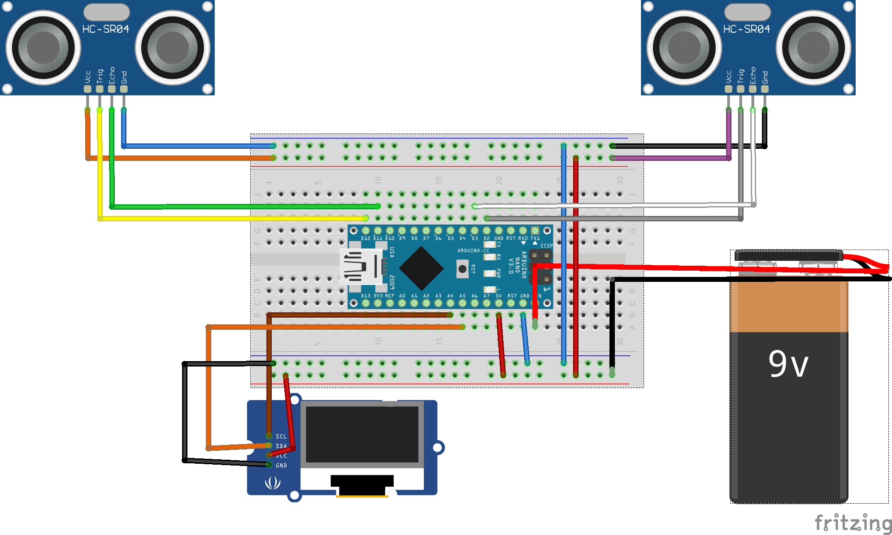

# Arduino Nerf Radar
This is done entirely in Arduino. Here are the things that you will need 
+ Arduino Nano
+ Bread Board
+ 2 HC-SR04 modules
+ OLED display of any size
+ Double sided Tape
+ A nerf Gun
+ And any nerf shield you please

Now download the code and run it and upload it on your arduino Ide 

Use the following schematics for the connections 

